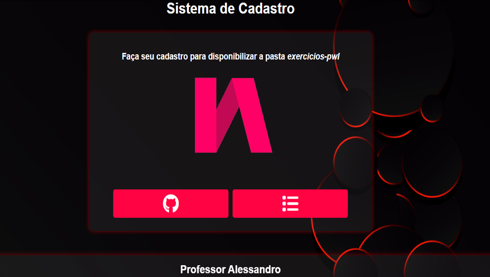
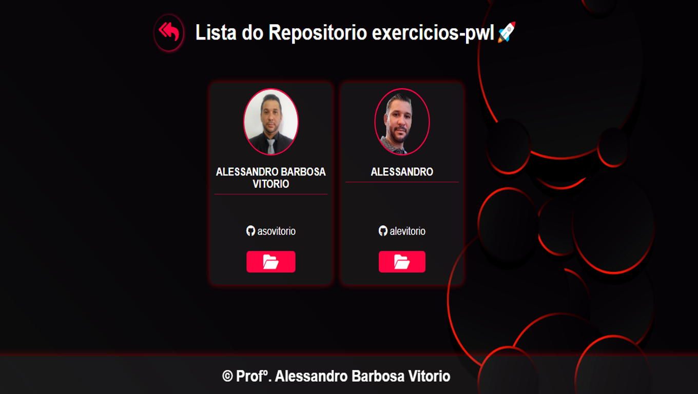

# 📌 Projeto de Mapeamento de Exercícios - Frontend


## 🚀 Sobre o Projeto
Este é o **frontend** de um sistema desenvolvido para **mapear e facilitar a correção dos exercícios** realizados pelos alunos da **ETEC Irmã Agustina**. A aplicação consome uma API que se conecta ao **GitHub** para obter:

✅ Nome do aluno 🏷️  
✅ Nome de usuário 🆔  
✅ Avatar do perfil 🖼️  
✅ Repositório chamado **exercicios-pwI** 📂 para visualizar **todos os exercícios dados pelo professor**  

Com isso, o professor pode visualizar todos os exercicios dos alunos **em um único lugar**, agilizando o processo de correção. 🎯

---

## 🛠️ Tecnologias Utilizadas

- **HTML5** 🏗️
- **CSS3** 🎨
- **JavaScript** ⚡
- **Fetch API** 🌐

---

## 📥 Instalação

Siga os passos abaixo para rodar o projeto localmente:

```bash
# Clone o repositório
$ git clone https://github.com/seu-usuario/seu-repositorio.git

# Acesse o diretório do projeto
$ cd nome-do-projeto

# Abra o arquivo index.html no navegador
```

---

## ⚙️ Configuração
Para que o frontend funcione corretamente, a API deve estar rodando. Certifique-se de configurar a URL da API no código JavaScript.

Edite o arquivo **script.js** e defina a URL da API:
```javascript
const API_BASE_URL = 'http://seu-servidor.com/api';
```
---

## 📸 Capturas de Tela
### Pagina Inicial de Navegação e Cadastro

### Pagina de listagem dos cards com o repositório


---

## 🤝 Contribuição
Quer contribuir com melhorias? Siga os passos:
1. Faça um **fork** do repositório 🍴
2. Crie uma **branch** com sua feature (`git checkout -b minha-feature`) 🌿
3. Faça o **commit** das alterações (`git commit -m 'Adiciona nova funcionalidade'`) 📌
4. Faça o **push** para a branch (`git push origin minha-feature`) 🚀
5. Abra um **Pull Request** 🛠️

---

## 📜 Licença
Este projeto é **open-source** e está sob a licença MIT.

---

💡 *Desenvolvido por [Prof° Alessandro]* ✨

